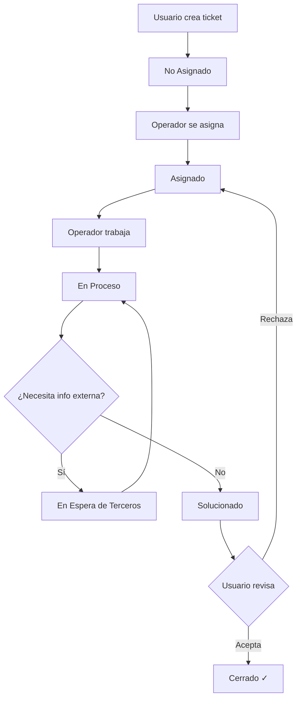

# 🎫 Sistema de Gestión de Tickets - Help Desk

<div align="center">


**Sistema completo de soporte técnico con gestión de tickets, usuarios y roles**

</div>

---

## 📋 Tabla de Contenidos

- [Descripción](#-descripción)
- [Características](#-características)
- [Requisitos](#-requisitos)
- [Instalación](#-instalación)
- [Configuración](#-configuración)
- [Estructura del Proyecto](#-estructura-del-proyecto)
- [Uso](#-uso)
- [Roles y Permisos](#-roles-y-permisos)
- [Flujo de Tickets](#-flujo-de-tickets)
- [API y Rutas](#-api-y-rutas)
- [Credenciales por Defecto](#-credenciales-por-defecto)
- [Solución de Problemas](#-solución-de-problemas)
- [Contribuir](#-contribuir)
- [Licencia](#-licencia)

---

## 🎯 Descripción

**Help Desk - Los Patitos S.A.** es un sistema completo de gestión de tickets de soporte técnico desarrollado en PHP vanilla con arquitectura MVC. Permite la gestión eficiente de solicitudes de soporte, seguimiento de incidentes y peticiones, con roles diferenciados para usuarios, operadores y superadministradores.

---

## ✨ Características

### 🎫 Gestión de Tickets
- ✅ Creación de tickets tipo **Petición** o **Incidente**
- ✅ Sistema de estados: No Asignado → Asignado → En Proceso → Solucionado → Cerrado
- ✅ Asignación automática y manual de operadores
- ✅ Categorías y prioridades personalizables
- ✅ Historial completo de cada ticket
- ✅ Comentarios y actualizaciones en tiempo real

### 👥 Gestión de Usuarios
- ✅ 3 roles: **Superadministrador**, **Operador**, **Usuario**
- ✅ Sistema de solicitud de registro para nuevos usuarios
- ✅ Aprobación/rechazo de solicitudes por administradores
- ✅ Perfiles de usuario con imágenes
- ✅ Asignación a departamentos

### 🔐 Seguridad
- ✅ Autenticación con contraseñas hasheadas (bcrypt)
- ✅ Control de acceso basado en roles
- ✅ Sesiones seguras
- ✅ Validación de datos en servidor

### 🎨 Interfaz
- ✅ Diseño moderno y responsive (Bootstrap 5)
- ✅ Tema oscuro con acentos naranja
- ✅ Animaciones y efectos visuales
- ✅ Dashboard personalizado por rol
- ✅ Filtros y búsqueda avanzada

---

## 🚀 Instalación

### Paso 1️⃣: Clonar el Repositorio
```bash
git clone https://github.com/tu-usuario/ticket-php.git
cd ticket-php
```

### Paso 2️⃣: Configurar Servidor Web

#### **XAMPP / WAMP (Windows)**
```bash
# Copiar el proyecto a:
C:\xampp\htdocs\ticket-php

# Acceder en navegador:
http://localhost/ticket-php
```

### Paso 3️⃣: Crear Base de Datos

#### **Opción A: phpMyAdmin**
1. Abrir http://localhost/phpmyadmin
2. Crear nueva base de datos
3. Ir a la pestaña "Importar"
4. Seleccionar archivo: `database.sql`
5. Hacer clic en "Continuar"

### Paso 4️⃣: Configurar Variables de Entorno
```bash
# Copiar archivo de ejemplo
cp .env.example .env
```

Editar `.env` con tus credenciales:
```ini
# Configuración de Base de Datos
DB_HOST=127.0.0.1
DB_NAME=helpdesk_db
DB_USER=root
DB_PASS=tu_contraseña_mysql
DB_CHARSET=utf8mb4

# Modo Debug (producción: false)
DEBUG=true
```

### Paso 5️⃣: Configurar Permisos

#### **Linux/Mac**
```bash
# Permisos generales
chmod -R 755 public/uploads
chmod -R 755 public/css
chmod -R 755 public/js

# Crear directorio de uploads si no existe
mkdir -p public/uploads/profiles
chmod 777 public/uploads/profiles
```

#### **Windows**
```bash
# Crear carpeta manualmente si no existe:
public\uploads\profiles
```

### Paso 6️⃣: Acceder al Sistema

Abrir en navegador:
```
http://localhost/ticket-php
```

**Credenciales por defecto:**
```
Usuario: admin
Contraseña: admin123
```
---

## 📁 Estructura del Proyecto
```
ticket-php/
├── 📁 app/
│   ├── 📁 Controllers/      # Controladores MVC
│   │   ├── HomeController.php
│   │   ├── AuthController.php
│   │   ├── TicketController.php
│   │   ├── UsuarioController.php
│   │   ├── PerfilController.php
│   │   └── SolicitudController.php
│   │
│   ├── 📁 Models/           # Modelos de datos
│   │   ├── User.php
│   │   ├── Ticket.php
│   │   ├── Entrada.php
│   │   ├── Rol.php
│   │   ├── Departamento.php
│   │   ├── Estado.php
│   │   ├── Categoria.php
│   │   ├── Prioridad.php
│   │   ├── ImagenPerfil.php
│   │   └── SolicitudRegistro.php
│   │
│   ├── 📁 Views/            # Vistas (HTML/PHP)
│   │   ├── 📁 auth/
│   │   ├── 📁 home/
│   │   ├── 📁 tickets/
│   │   ├── 📁 users/
│   │   ├── 📁 perfil/
│   │   ├── 📁 solicitudes/
│   │   └── 📁 layouts/
│   │
│   └── 📁 Core/             # Núcleo del sistema
│       ├── Router.php       # Enrutador
│       ├── Controller.php   # Controlador base
│       ├── Model.php        # Modelo base
│       └── View.php         # Renderizador de vistas
│
├── 📁 config/
│   └── database.php         # Configuración de BD
│
├── 📁 public/               # Archivos públicos
│   ├── 📁 css/
│   │   ├── styles.css
│   │   └── home.css
│   ├── 📁 uploads/
│   │   └── 📁 profiles/     # Imágenes de perfil
│   ├── .htaccess
│   └── index.php            # Punto de entrada
│
├── .env.example             # Ejemplo de configuración
├── .gitignore
├── .htaccess                # Redirección a public/
├── database.sql             # Script de base de datos
├── LICENSE
└── README.md
```

---

## 🎮 Uso

### Primer Acceso

1. **Acceder al sistema:**
```
   http://localhost/ticket-php
```

2. **Iniciar sesión como administrador:**
```
   Usuario: admin
   Contraseña: admin123
```

3. **Cambiar contraseña:**
   - Ir a: Perfil → Editar Perfil
   - Ingresar nueva contraseña
   - Guardar cambios

### Crear Usuarios

#### Opción 1: Desde Panel de Administración
```
Panel Admin → Usuarios → Crear Nuevo Usuario
```

#### Opción 2: Solicitud Pública
1. Usuario visita: `http://localhost/ticket-php/request-access`
2. Completa formulario de solicitud
3. Admin revisa en: `Panel Admin → Solicitudes`
4. Admin aprueba o rechaza la solicitud

### Crear un Ticket (Como Usuario)

1. Login con cuenta de usuario
2. Click en "Crear Nuevo Ticket"
3. Llenar formulario:
   - **Título:** Descripción breve
   - **Tipo:** Petición o Incidente
   - **Categoría:** (Opcional)
   - **Prioridad:** (Opcional)
   - **Descripción:** Detalle completo del problema
4. Enviar ticket

### Gestionar Tickets (Como Operador)

1. Login con cuenta de operador
2. Ver tickets no asignados en "Cola Global"
3. Asignar ticket a sí mismo
4. Trabajar en el ticket:
   - Agregar comentarios
   - Cambiar estado según progreso
   - Marcar como "Solucionado"
5. Usuario acepta o rechaza la solución
6. Ticket se cierra cuando usuario acepta

### Panel de Superadministrador

#### Gestión de Usuarios
```
Usuarios → Ver lista completa
         → Crear/Editar/Activar/Desactivar
         → Asignar roles y departamentos
```

#### Gestión de Solicitudes
```
Solicitudes → Ver pendientes
            → Aprobar (crea usuario automáticamente)
            → Rechazar (con motivo)
```

#### Gestión Global de Tickets
```
Tickets → Ver todos los tickets
        → Filtrar por estado/tipo/operador
        → Búsqueda avanzada
        → Ver detalles completos
```

---

## 👥 Roles y Permisos

### 🔴 Superadministrador
**Permisos totales del sistema**

✅ Gestionar usuarios (crear, editar, activar, desactivar)
✅ Gestionar solicitudes de registro
✅ Ver y gestionar todos los tickets
✅ Acceder a estadísticas globales
✅ Configurar sistema

**Restricciones:**
❌ No puede desactivarse a sí mismo

### 🟡 Operador
**Personal de soporte técnico**

✅ Ver cola de tickets no asignados
✅ Asignarse tickets
✅ Gestionar sus tickets asignados
✅ Actualizar estados de tickets
✅ Agregar comentarios (visibles para usuarios)
✅ Marcar tickets como solucionados

**Restricciones:**
❌ No puede ver tickets de otros operadores
❌ No puede gestionar usuarios
❌ No puede aprobar solicitudes

### 🟢 Usuario
**Usuario final del sistema**

✅ Crear tickets de soporte
✅ Ver sus propios tickets
✅ Agregar comentarios a sus tickets
✅ Aceptar o rechazar soluciones propuestas
✅ Editar su perfil

**Restricciones:**
❌ No puede ver tickets de otros usuarios
❌ No puede asignarse operadores
❌ No puede cambiar estados manualmente
❌ No puede acceder al panel de administración

---

## 🔄 Flujo de Tickets


### Estados Detallados

| Estado | Descripción | Siguiente Estado Posible |
|--------|-------------|-------------------------|
| **No Asignado** | Ticket recién creado | Asignado |
| **Asignado** | Operador asignado | En Proceso |
| **En Proceso** | Trabajando en solución | En Espera / Solucionado |
| **En Espera de Terceros** | Requiere información adicional | En Proceso |
| **Solucionado** | Solución propuesta | Cerrado / Asignado |
| **Cerrado** | Ticket finalizado | (Estado final) |

---

## 🛣️ API y Rutas

### Rutas Públicas

| Método | Ruta | Descripción |
|--------|------|-------------|
| GET | `/` | Página de inicio |
| GET | `/login` | Formulario de login |
| POST | `/login` | Procesar login |
| GET | `/logout` | Cerrar sesión |
| GET | `/request-access` | Solicitar registro |
| POST | `/request-access` | Enviar solicitud |

### Rutas de Usuarios (Autenticado)

| Método | Ruta | Descripción | Rol Requerido |
|--------|------|-------------|---------------|
| GET | `/tickets` | Dashboard de tickets | Todos |
| GET | `/tickets/create` | Crear ticket | Usuario |
| POST | `/tickets/store` | Guardar ticket | Usuario |
| GET | `/tickets/{id}` | Ver ticket | Propietario/Operador/Admin |
| GET | `/perfil/edit` | Editar perfil | Todos |
| POST | `/perfil/update` | Actualizar perfil | Todos |

### Rutas de Operador

| Método | Ruta | Descripción |
|--------|------|-------------|
| POST | `/tickets/{id}/assign` | Asignarse ticket |
| POST | `/tickets/{id}/update-status` | Cambiar estado |
| POST | `/tickets/{id}/add-entry` | Agregar comentario |

### Rutas de Administración

| Método | Ruta | Descripción |
|--------|------|-------------|
| GET | `/users` | Listar usuarios |
| GET | `/users/create` | Crear usuario |
| POST | `/users/store` | Guardar usuario |
| GET | `/users/edit/{id}` | Editar usuario |
| POST | `/users/update/{id}` | Actualizar usuario |
| GET | `/users/activate/{id}` | Activar usuario |
| GET | `/users/deactivate/{id}` | Desactivar usuario |
| GET | `/solicitudes` | Listar solicitudes |
| GET | `/solicitudes/{id}` | Ver solicitud |
| POST | `/solicitudes/{id}/aprobar` | Aprobar solicitud |
| POST | `/solicitudes/{id}/rechazar` | Rechazar solicitud |

---

## 📄 Licencia

Este proyecto está bajo la Licencia MIT - ver el archivo [LICENSE](LICENSE) para detalles.
```
MIT License

Copyright (c) 2025 Gerald Gonzalez Granados

Permission is hereby granted, free of charge, to any person obtaining a copy
of this software and associated documentation files (the "Software"), to deal
in the Software without restriction, including without limitation the rights
to use, copy, modify, merge, publish, distribute, sublicense, and/or sell
copies of the Software, and to permit persons to whom the Software is
furnished to do so, subject to the following conditions:

The above copyright notice and this permission notice shall be included in all
copies or substantial portions of the Software.

THE SOFTWARE IS PROVIDED "AS IS", WITHOUT WARRANTY OF ANY KIND, EXPRESS OR
IMPLIED, INCLUDING BUT NOT LIMITED TO THE WARRANTIES OF MERCHANTABILITY,
FITNESS FOR A PARTICULAR PURPOSE AND NONINFRINGEMENT. IN NO EVENT SHALL THE
AUTHORS OR COPYRIGHT HOLDERS BE LIABLE FOR ANY CLAIM, DAMAGES OR OTHER
LIABILITY, WHETHER IN AN ACTION OF CONTRACT, TORT OR OTHERWISE, ARISING FROM,
OUT OF OR IN CONNECTION WITH THE SOFTWARE OR THE USE OR OTHER DEALINGS IN THE
SOFTWARE.
```

---

## Autor

**Gerald Gonzalez Granados**

- GitHub: [@Gerald-JGG](https://github.com/Gerald-JGG)
- Email: contacto@example.com

---